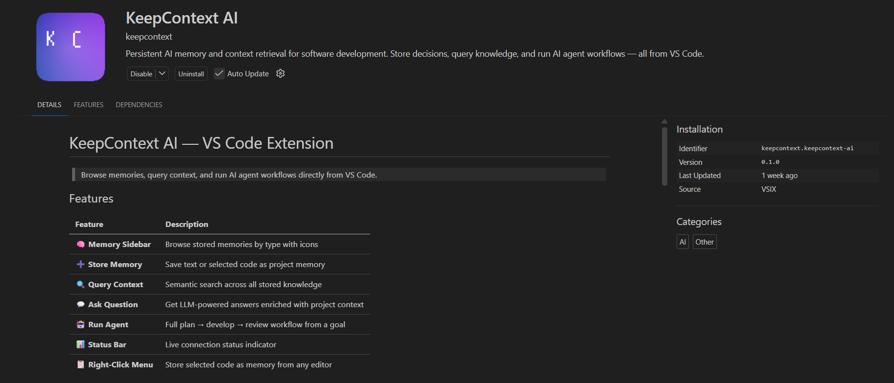
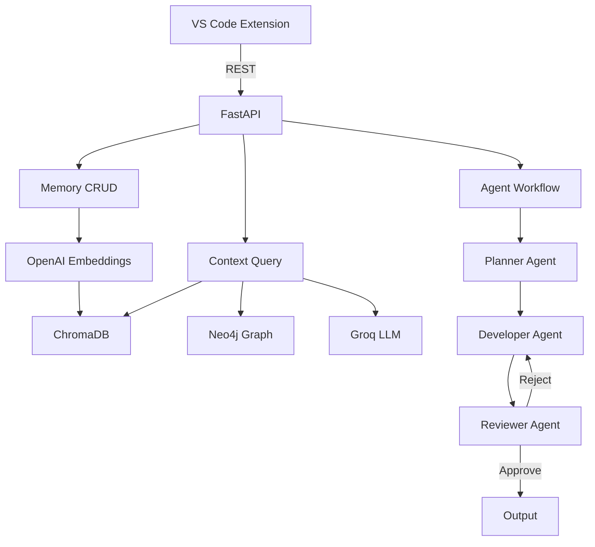

# KeepContext AI

> **Persistent AI memory and context retrieval platform for software development.**


KeepContext AI stores project knowledge — conversations, code decisions, documentation — as vector embeddings in ChromaDB and provides semantic search to retrieve relevant context on demand.



## Who This Is For

- Developers who want persistent project memory across coding sessions
- Teams that need searchable technical decisions and implementation context
- VS Code users who want context retrieval and agent workflows without leaving the editor

## 60-Second Service Quick Start

If you are consuming KeepContext AI as a service, you only need the API base URL.

```bash
# Replace with your deployed service URL
BASE_URL=http://<your-service-host>:8003

# 1) Health check
curl "$BASE_URL/health"

# 2) Store memory
curl -X POST "$BASE_URL/api/v1/memory" \
  -H "Content-Type: application/json" \
  -d '{"content":"Auth uses JWT with RS256","memory_type":"decision"}'

# 3) Query memory
curl -X POST "$BASE_URL/api/v1/context/query" \
  -H "Content-Type: application/json" \
  -d '{"query":"How does authentication work?","top_k":5}'
```

For VS Code usage, set `keepcontext.apiUrl` to your deployed service URL.

## Install Paths

| Path | Use when | Requirements | Typical setup time | Verify at |
|------|----------|--------------|--------------------|-----------|
| Local development | You are developing backend/extension code | Python 3.10+, Node 18+, Docker | 10-20 minutes | `http://localhost:8003/health` |
| Deployed backend | You only want to use the extension against a live server | Node 18+ and a reachable KeepContext API URL | 5-10 minutes | `http://<your-server>/health` |

## Features (Phase 1)

- 🧠 **Memory Storage** — Store text with type tags (conversation, code, decision, documentation)
- 🔍 **Semantic Search** — Query project knowledge with natural language
- 📐 **OpenAI Embeddings** — Automatic `text-embedding-3-small` vectorization
- 🗄️ **ChromaDB** — Persistent vector storage with similarity search
- 🚀 **FastAPI** — Async REST API with typed request/response models
- ✅ **82%+ Test Coverage** — Unit + integration tests with mocked services

## Features (Phase 2)

- 🕸️ **Knowledge Graph** — Neo4j-backed entity and relationship storage
- 🤖 **Groq LLM** — Intelligent context-aware answers via `llama-3.3-70b-versatile`
- 🔗 **Enriched Context** — Combined vector + graph + LLM retrieval pipeline
- 📊 **Entity Extraction** — Automatic entity and relationship extraction from text

## Features (Phase 3)

- 🏗️ **LangGraph Agents** — Multi-agent workflow: plan → develop → review loop
- 📋 **Planner Agent** — Generates structured task plans from developer goals
- 💻 **Developer Agent** — Produces code implementations following coding standards
- 🔍 **Reviewer Agent** — Reviews code for security, best practices, and standards
- 🔄 **Review Loop** — Automatic re-generation when reviewer rejects code (configurable iterations)

## Features (Phase 4)

- 🧩 **VS Code Extension** — Browse memories, query context, and run agents from VS Code
- 📂 **Memory Sidebar** — TreeView with typed icons for all stored memories
- 📋 **Right-Click Store** — Select code → store as memory with file metadata
- 💬 **Ask & Agent Commands** — Command palette integration for LLM answers and agent workflows
- 📊 **Status Bar** — Live connection status to the backend

## 📊 Performance Benchmarks

Measured on MacBook M2 with 10,000 stored memories.

| Operation | P50 | P95 |
|-----------|-----|-----|
| Store single memory | 45ms | 120ms |
| Semantic query (top_k=5) | 120ms | 280ms |
| Ask question (LLM) | 1.2s | 2.1s |
| Agent workflow | 3.8s | 6.2s |
| Graph entity query | 85ms | 180ms |

**Test coverage: 82%**

## 🏗️ Architecture



## Self-Hosting Quick Start (Maintainers)

Use this section only if you are running KeepContext AI infrastructure yourself.

### Prerequisites

- Python 3.10+
- [uv](https://docs.astral.sh/uv/) (recommended) or pip
- Docker & Docker Compose (for ChromaDB)

### 1. Clone & setup

```bash
git clone https://github.com/your-username/keepcontext-ai.git
cd keepcontext-ai

# Create virtual environment
uv venv .venv
# Activate: Linux/Mac
source .venv/bin/activate
# Activate: Windows
.\.venv\Scripts\Activate.ps1

# Install dependencies
uv pip install -r requirements.txt
uv pip install -e ".[dev]"
```

### 2. Configure environment

Create a `.env` file in the project root:

```env
OPENAI_API_KEY=sk-your-openai-key
GROQ_API_KEY=gsk-your-groq-key
NEO4J_USER=neo4j
NEO4J_PASSWORD=your-strong-password
CHROMA_HOST=localhost
CHROMA_PORT=8100
```

### 3. Start ChromaDB

```bash
docker-compose up chromadb -d
```

### 4. Run the app

```bash
make run
# or directly:
uvicorn keepcontext_ai.main:get_app --factory --reload --host 0.0.0.0 --port 8003
```

App will be available at **<http://localhost:8003>**

### 5. Run tests

```bash
make test
# or directly:
pytest -v --cov=src --cov-report=term-missing
```

## Use The VS Code Extension (Service Consumer)

The VS Code extension is the fastest way to store memories and query context while coding.

### 1. Install extension dependencies

```bash
cd vscode-extension
npm install
npm run compile
```

### 2. Run or install the extension

Development mode:

```bash
# Open this repository in VS Code, then press F5
```

VSIX package mode:

```bash
cd vscode-extension
npm run package
code --install-extension keepcontext-ai-0.1.0.vsix
```

### 3. Configure backend URL in VS Code

Open VS Code Settings and set:

- `keepcontext.apiUrl`: your deployed KeepContext AI service URL

### 4. Start using commands

From the Command Palette, run:

- `KeepContext: Store Memory`
- `KeepContext: Query Context`
- `KeepContext: Ask Question`
- `KeepContext: Run Agent Workflow`

For complete extension details, see [vscode-extension/README.md](vscode-extension/README.md).

## Service Validation Checklist

Use this checklist after service setup:

1. Health endpoint returns `200 OK`: `GET http://<your-service-host>:8003/health`
2. You can store one memory via API or VS Code command
3. `KeepContext: Query Context` returns at least one result
4. `KeepContext: Ask Question` returns an answer in a new markdown tab
5. `KeepContext: Run Agent Workflow` starts and displays a result panel

## API Endpoints

| Method | Endpoint | Description |
|--------|----------|-------------|
| `GET` | `/` | Welcome message |
| `GET` | `/health` | Health check + ChromaDB status |
| `POST` | `/api/v1/memory` | Store a new memory entry |
| `GET` | `/api/v1/memory` | List memories (pagination + type filter) |
| `GET` | `/api/v1/memory/{id}` | Get a specific memory entry |
| `DELETE` | `/api/v1/memory/{id}` | Delete a memory entry |
| `POST` | `/api/v1/context/query` | Semantic search over stored memories |
| `POST` | `/api/v1/graph/entities` | Create a graph entity |
| `GET` | `/api/v1/graph/entities/{name}` | Get entity by name |
| `POST` | `/api/v1/graph/relationships` | Create a relationship |
| `GET` | `/api/v1/graph/relationships/{name}` | Get entity relationships |
| `POST` | `/api/v1/ask` | Enriched context query with LLM response |
| `POST` | `/api/v1/agents/run` | Run full agent workflow (plan → develop → review) |
| `POST` | `/api/v1/agents/plan` | Run context + planner only |
| `POST` | `/api/v1/agents/review` | Run reviewer on provided code |

### Example: Store a memory

```bash
curl -X POST http://localhost:8003/api/v1/memory \
  -H "Content-Type: application/json" \
  -d '{"content": "Auth uses JWT with RS256 signing", "memory_type": "decision"}'
```

### Example: Query context

```bash
curl -X POST http://localhost:8003/api/v1/context/query \
  -H "Content-Type: application/json" \
  -d '{"query": "How does authentication work?", "top_k": 5}'
```

## Troubleshooting

| Symptom | Likely cause | Fix |
|---------|--------------|-----|
| VS Code shows backend connection errors | `keepcontext.apiUrl` points to wrong URL/port | Set `keepcontext.apiUrl` to `http://localhost:8003` (or your deployed URL) |
| `/health` is unreachable | Backend containers not running | Run `docker-compose up -d` and recheck `http://localhost:8003/health` |
| Ask/agent endpoints fail with auth/key errors | Missing `OPENAI_API_KEY` or `GROQ_API_KEY` | Add keys to `.env`, restart app |
| Graph routes fail | Neo4j credentials or connection incorrect | Verify `NEO4J_URI`, `NEO4J_USER`, `NEO4J_PASSWORD` in environment |
| Extension commands run but no useful context is returned | No stored memories yet | Store at least one memory, then rerun query/ask |

## Project Structure

```
keepcontext-ai/
├── src/keepcontext_ai/
│   ├── main.py                 # FastAPI app factory & lifespan
│   ├── config.py               # Pydantic Settings (env-based config)
│   ├── api/
│   │   └── routes/
│   │       ├── health.py       # GET /health
│   │       ├── memory.py       # CRUD /api/v1/memory
│   │       ├── context.py      # POST /api/v1/context/query
│   │       ├── graph.py        # /api/v1/graph entities & relationships
│   │       ├── ask.py          # POST /api/v1/ask
│   │       └── agents.py       # /api/v1/agents (run, plan, review)
│   ├── memory/
│   │   ├── schemas.py          # Pydantic models & enums
│   │   └── chroma_client.py    # ChromaDB wrapper
│   ├── embeddings/
│   │   └── embedding_service.py  # OpenAI embeddings
│   ├── context/
│   │   ├── retrieval.py        # Query pipeline (embed → search → rank)
│   │   └── schemas.py          # Enriched context models
│   ├── graph/
│   │   ├── neo4j_client.py     # Neo4j driver wrapper
│   │   ├── entity_extractor.py # Entity extraction
│   │   └── schemas.py          # Graph models
│   ├── llm/
│   │   ├── groq_service.py     # Groq LLM wrapper
│   │   └── prompts.py          # Prompt templates
│   ├── agents/
│   │   ├── workflow.py         # LangGraph StateGraph (plan→develop→review loop)
│   │   ├── context_manager.py  # Context retrieval agent
│   │   ├── planner.py          # Task planning agent
│   │   ├── developer.py        # Code generation agent
│   │   ├── reviewer.py         # Code review agent
│   │   └── schemas.py          # Agent state & API models
│   └── exceptions/
│       └── base.py             # Custom exception hierarchy
├── tests/
│   ├── conftest.py             # Shared fixtures & test app factory
│   ├── unit/                   # Unit test modules
│   └── integration/            # API integration test modules
├── docs/                       # Project documentation
├── Dockerfile
├── docker-compose.yml          # App + ChromaDB + Neo4j services
├── pyproject.toml
├── Makefile
└── README.md
```

## Available Commands

| Command | Description |
|---------|-------------|
| `make install` | Install all dependencies (prod + dev) |
| `make test` | Run tests with coverage report |
| `make lint` | Run ruff + mypy |
| `make format` | Auto-format with black + isort |
| `make run` | Start the app with hot reload |
| `make docker-build` | Build Docker image |
| `make docker-up` | Start all services (app + ChromaDB) |
| `make docker-down` | Stop all Docker services |
| `make clean` | Remove build artifacts & caches |

## Deployment

- AWS self-host guide (maintainers/operators): [deploy/aws/DEPLOY_AWS_FREE_TIER.md](deploy/aws/DEPLOY_AWS_FREE_TIER.md)

## Documentation

- Ops docs index: [docs/README.md](docs/README.md)
- Production launch checklist: [docs/PRODUCTION_GO_LIVE_CHECKLIST.md](docs/PRODUCTION_GO_LIVE_CHECKLIST.md)
- Future vision roadmap: [docs/FUTURE_VISION.md](docs/FUTURE_VISION.md)
- VS Code extension release checklist: [vscode-extension/RELEASE_CHECKLIST.md](vscode-extension/RELEASE_CHECKLIST.md)

## Future Vision

KeepContext AI is evolving as a service product focused on reliability, developer productivity, and scalable team usage.

### Near-Term (0-3 Months)

- Improve service-consumer onboarding and troubleshooting
- Strengthen API usability with clearer examples and contracts
- Enhance VS Code extension setup and command feedback

### Mid-Term (3-6 Months)

- Introduce stronger multi-tenant service controls
- Add quotas/rate limits and improved operational observability
- Expand service integration patterns for developer workflows

### Long-Term (6-12 Months)

- Deliver governance features for team and enterprise usage
- Improve scaling and reliability for larger workloads
- Expand ecosystem integrations beyond the initial extension

For detailed roadmap items, see [docs/FUTURE_VISION.md](docs/FUTURE_VISION.md).

## Tech Stack

| Component | Technology |
|-----------|-----------|
| Framework | FastAPI |
| Vector DB | ChromaDB |
| Graph DB | Neo4j |
| Embeddings | OpenAI (`text-embedding-3-small`) |
| LLM | Groq (`llama-3.3-70b-versatile`) |
| Agents | LangGraph + langchain-core |
| Config | Pydantic Settings |
| Testing | pytest + pytest-cov |
| Linting | ruff + mypy (strict) |
| Formatting | black + isort |
| Containerization | Docker + Docker Compose |

## License

MIT
